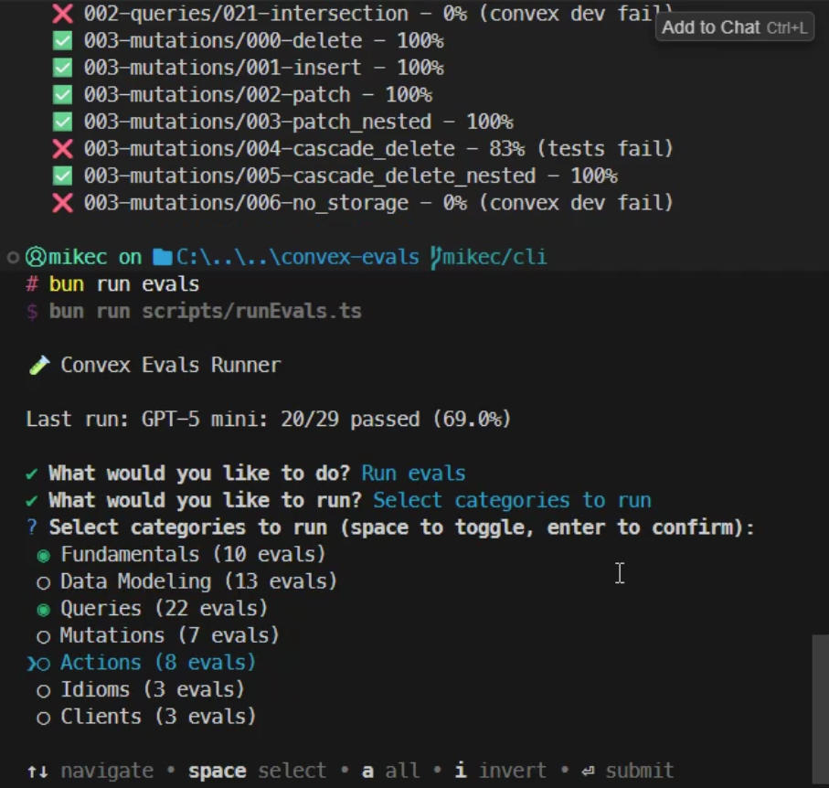

# Convex Coding Evals

Convex is an open-source, reactive database that's the best platform for full-stack AI coding.

We ensure that Convex performs well with a large set of models by continuously running evals. Each eval has a set prompts for coding a Convex backend, a set of human-curated solutions, and a script for evaluating the LLM's output. These evals are split up into eight different categories:

- Fundamentals
- Data Modeling
- Queries
- Mutations
- Actions
- Idioms
- Clients
- Components

The most up to date eval runs can be found on our [website](https://convex.dev/llm-leaderboard).

Detailed results from production runs can be visualized at [convex-evals.netlify.app](https://convex-evals.netlify.app/):


We use these evals to tune our [Convex Guidelines](https://docs.convex.dev/ai/), which greatly improve model performance writing Convex code and decrease hallucinations.

## Running the evaluations

First, install dependencies:

```bash
npm install -g bun
bun install

echo "ANTHROPIC_API_KEY=<your ANTHROPIC_API_KEY>" > .env
echo "OPENAI_API_KEY=<your OPENAI_API_KEY>" >> .env
bun run setup:convex
```

`bun run setup:convex` creates ignored `.env.local` files for the shared Convex
development deployment. Codex worktrees run this automatically via
`.codex/environments/environment.toml`; run it manually in existing worktrees or
non-Codex clones before using `evalScores` codegen or the visualizer. `bun run
dev` also runs it automatically.

### Using the CLI (recommended)

The easiest way to run evals is with the interactive CLI:

```bash
bun run evals
```

[](docs/assets/cli.mp4)

This launches an interactive menu where you can:

- Run all evals
- Select specific categories to run
- Select individual evals
- Re-run failed evals from your last run
- Choose which model(s) to use

#### CLI Commands

| Command                         | Description                            |
| ------------------------------- | -------------------------------------- |
| `bun run evals`                 | Interactive mode                       |
| `bun run evals list`            | List all available evals by category   |
| `bun run evals status`          | Show results from last run             |
| `bun run evals status --failed` | Show only failed evals                 |
| `bun run evals models`          | List available models                  |
| `bun run evals:failed`          | Re-run only failed evals from last run |

#### CLI Options

Run evals directly without interactive mode:

```bash
# Run specific categories
bun run evals run -c 000-fundamentals 002-queries

# Run with a specific model
bun run evals run -m anthropic/claude-sonnet-5 -c 005-idioms

# Run with multiple models
bun run evals run -m anthropic/claude-sonnet-5 -m openai/gpt-5.5 -f "000-fundamentals"

# Re-run failed evals
bun run evals run --failed

# Filter by regex pattern
bun run evals run -f "pagination"

# Post results to Convex database
bun run evals run --post-to-convex -c 000-fundamentals
```

### Running directly

You can run the eval runner directly:

```bash
bun run runner/index.ts
```

You can specify a test filter regex via an environment variable:

```bash
TEST_FILTER='data_modeling' bun run runner/index.ts
```

The test will also print out what temporary directory it's using for storing the generated files. You can override this
with the `OUTPUT_TEMPDIR` environment variable.

```bash
OUTPUT_TEMPDIR=/tmp/convex-codegen-evals bun run runner/index.ts
```

### Environment variables

`no_guidelines_with_web` provides common web tools in our harness. It currently
pins OpenRouter search and fetch to Exa using the existing `OPENROUTER_API_KEY`.
Use `DISABLE_CONVEX_REPORTING=1` until the updated backend is deployed. See the
[experiment guide](docs/no-guidelines-with-web.md) for its limits and traces.

| Variable            | Description                                             |
| ------------------- | ------------------------------------------------------- |
| `MODELS`            | Comma-separated list of models to run                   |
| `TEST_FILTER`       | Regex pattern to filter evals                           |
| `OUTPUT_TEMPDIR`    | Directory for generated output files                    |
| `CONVEX_EVAL_URL`   | Convex deployment URL (e.g. `https://xxx.convex.cloud`) |
| `CONVEX_AUTH_TOKEN` | Auth token for the Convex backend                       |

### Output

- Per-step progress lines with the eval id
- Per-eval result with pass/fail status and a clickable output dir

## Adding a new evaluation

Note that test or category names cannot contain dashes.

1. Create a new directory under `evals/<category>/<name>/`
2. Add a `TASK.txt` file describing what the LLM should do
3. Add an `answer/` directory with the human-curated solution
4. Add a `grader.test.ts` file with unit tests
5. Run the eval to verify it works

### Implementing the answer

1. Create `schema.ts` first
2. Run codegen to generate types:
   ```bash
   cd evals/<category>/<eval>/answer && bunx convex codegen
   ```
3. Implement solution files
4. Run codegen again after any schema changes

## Writing evals

### What we're testing

Each eval should make one specific claim about a Convex capability. State that claim before writing or changing its task or grader:

- **API knowledge or requested usage:** the task requests a capability or API family, and the eval checks correct implementation. Exact method names can remain unstated when knowing them is part of the claim.
- **Unprompted selection:** the task describes a need, and the eval checks whether the model chooses a particular pattern or component. A miss establishes that the desired choice was not made; it does not establish that an alternative implementation is broken.
- **Behavioral correctness:** the task states the required behavior, and equivalent correct implementations must be accepted unless an implementation constraint is justified by the stated claim.

Be explicit about product requirements, interfaces, edge cases, and relevant scale. Withholding API mechanics can be intentional; leaving product behavior ambiguous is a separate issue. Record what a pass does **not** establish, such as spontaneous API selection, complete pagination, or production-scale correctness.

Review the actual task and context sent to the model, including the experiment, SDK version, and available tools. `no_guidelines` omits the guidelines and research tools, and scoring does not give the model a code-repair loop. Guideline coverage alone is not sufficient evidence of model fault. A wrong answer, an ambiguous task, and a grader defect can coexist.

Before changing a score, separate those three questions: is the requested capability worth measuring, does the prompt support the graded requirement, and does the grader distinguish correct from incorrect implementations? If a prompt change makes an implicit choice explicit, record the changed measurement; do not reinterpret historical scores under the new contract.

### Writing good prompts

1. **Be explicit about schema** - always provide the complete schema in the prompt using TypeScript code blocks

2. **Clear requirements** - for each function, specify:

   - Exact function name
   - Required arguments and their types
   - Expected return type/structure
   - Any specific behaviors or edge cases to handle

3. **Scope the context** - describe the feature and its domain constraints. Omit API mechanics only when recalling or selecting them is the intended measurement. Do not assume guidelines are present in every experiment.

4. **Implementation constraints** - specify what files to create, what NOT to do, and any performance considerations that aren't obvious from the guidelines.

### Common pitfalls

1. **Ambiguous requirements** - don't leave function names unspecified; don't use vague terms like "appropriate" without context; always specify exact field names and types

2. **Over-complication** - don't test multiple concepts in one eval; keep schemas focused on the tested concept

3. **Missing context** - describe the problem domain and required behavior clearly; decide separately whether API references belong in this eval's supplied context

4. **Untestable requirements** - make success criteria measurable; specify exact return types; include specific test cases

5. **Over-specification** - do not give away a choice the eval claims to measure. Explicit API instructions are appropriate for usage evals, but change an unprompted-selection eval into a different measurement.

### Grader validation

Use real data and runtime behavior where possible. For required API use, verify that the relevant operation executes or that the returned artifact derives from it. Merely finding an identifier, import, or correctly shaped call is not enough.

Every grader correction needs both sides of a regression matrix:

- Equivalent valid answers: aliases, constants, shorthand and quoted properties, helpers, and module organization permitted by the task.
- Invalid answers that look plausible: unused correct calls, fake local objects, wrong limits, hardcoded defaults, unrelated operations, and incomplete results.

Keep those regression tests separate from scored assertions so adding fixtures does not change an eval's weighting. Validate the reference and targeted alternatives through the real scoring pipeline. A passing reference alone does not validate the grader.

Execution probes also need scrutiny: an incomplete SDK mock can reject valid code. Cover harmless operations allowed by the task, and document sampled paths and unsupported behavior. Neither a source check nor a sampled execution probe proves correctness for every possible program.

The [Astra task-contract review](docs/astra-eval-contract-review.md) applies this process to the recurring failures audited in September 2026.

### Eval structure

Each eval directory contains:

- `TASK.txt` - the prompt sent to the model
- `answer/` - the human-curated reference solution
- `grader.test.ts` - Vitest tests that score the model's output

The default pipeline installs, deploys, typechecks, lints, and tests a backend.
An optional `eval.json` can select another pipeline:

- `{"pipeline":"static"}` runs a grader directly on raw files, for component
  selection evals that deliberately tolerate syntax and stale API errors.
- `{"pipeline":"module"}` installs dependencies and runs a grader without a
  backend. The grader must typecheck and execute the module against the task's
  SDK version. Module prompts follow the task's file list and dependency pins
  instead of the default backend scaffolding instructions.

### Common eval types

- **Data modeling** - table relationships, index design, schema validation
- **Query patterns** - CRUD, index usage, filtering, joins, pagination, aggregation
- **Actions** - external calls, storage, node runtime, HTTP endpoints
- **Idioms** - internal functions, file organisation, batch patterns, code reuse

## AI grading

Grader tests can include a lightweight AI-based assessment that reviews the generated project and provides concise reasoning on pass/fail.

The grader builds a prompt from `TASK.txt` plus a manifest of files from the generated output directory and asks a model to decide pass/fail with reasoning. On failure, the reasoning appears directly in the test output and in `run.log`.

### Usage

Add a single standardised test using the helper:

```ts
import { createAIGraderTest } from "../../../grader/aiGrader";

// Basic usage (default name and 60s timeout)
createAIGraderTest(import.meta.url);

// Optional: custom name/timeout
createAIGraderTest(import.meta.url, "AI grader assessment", 60000);
```

## Generating guidelines

```bash
bun run build:release
```

This will generate guideline files in the `dist/` directory for various AI coding assistants.

## Listing models

```bash
bun run list:models
bun run scripts/listModels.ts --format json
bun run scripts/listModels.ts --due-only --format json
```

## Automated eval workflows

The repo has one scheduled periodic eval workflow:

- `periodic_evals.yml` runs every 4 hours
- each run unions candidates from curated models, top-weekly non-curated OpenRouter models, and top OpenRouter benchmark models
- the combined candidate list is deduped before the workflow matrix expands

The periodic workflow uses the same scheduling policy before it actually queues a model:

- if we have never run a model before, it is due immediately
- otherwise we look at the model's stored OpenRouter first-seen timestamp
- the target interval starts at `24h`, grows with model age, hits about `30d` at one year old, and approaches `60d` for very old models
- the due check uses the latest default-experiment attempt across benchmark versions, so minting a benchmark cannot make every model immediately due
- failed attempts preserve the scheduling cooldown, while `no_guidelines` runs do not delay the next default run

The OpenRouter-derived selectors also do a lightweight preflight check so obviously dead models are skipped before entering the matrix.

### Leaderboard benchmark versions

Benchmark versions are minted manually after a meaningful batch of eval work
is complete. The version itself is a deterministic hash derived from the
scoring protocol, system prompt, guidelines, and complete eval suite. Minting
is metadata-only: it does not queue or run any model, and the periodic workflow
continues using the age- and cost-aware schedule above.

The public leaderboard shows only scores from the current version. Older
versions remain available in the archive. Pre-versioning runs are backfilled
into reconstructed versions using the exact sorted planned-eval set and the
date that suite first appeared. A few historical partial runs use the version
active on their run date, but are excluded from aggregates because their
planned eval count does not match that version.

Runs store a Convex document ID into the `benchmarkVersions` table. New suite
hashes that have not been manually minted point to a private `unminted`
sentinel, so the foreign key is always present without publishing a version
automatically. Local runners are also prevented from reporting to the
production Convex deployment.

After explicit approval, mint the version against a configured deployment:

```bash
bun run benchmark:mint
```
